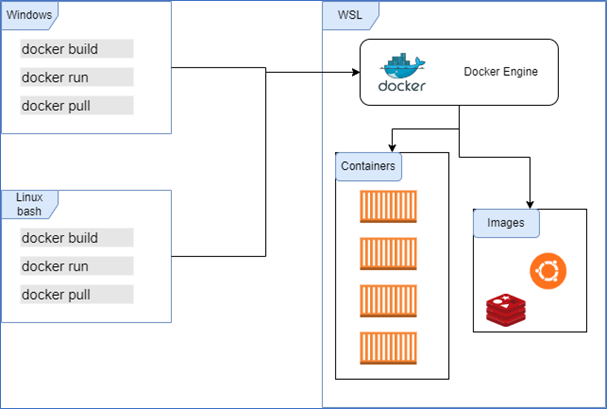

Docker Desktop wird kostenplichtig. Wir zeigen Ihnen eine kostenfreie Alternative - Docker im Windows Subsystem for Linux (WSL)
<!--truncate-->

Die kostenfreien Produkte von Docker werden von Millionen Entwicklern verwendet, um Anwendungen zu erstellen, zu veröffentlichen und auszuführen – in Rechenzentren, der public cloud oder mit Docker Desktop auf dem lokalen PC. 55% der Entwickler nutzen Docker jeden Tag bei der Arbeit.

#### Docker Desktop wird kostenpflichtig
Doch die Firma Docker muss auch wirtschaftlich arbeiten und hat beschlossen, im Rahmen einer Umgestaltung des Geschäftsmodells Gebühren für Unternehmenskunden zu erheben. Ab dem 31.01.2022 wird jegliche Nutzung von Docker Desktop für Nutzer in Unternehmen mit mehr als 250 Beschäftigten oder einem Jahresumsatz von mehr als 10 Millionen Dollar kostenpflichtig sein. Ein Abonnement kostet dann je nach weiten genutzten Diensten und Zahlungsweise zwischen 7$ und 21$ pro Nutzer und Monat. Für Unternehmen und Behörden stellt sich daher die Frage, ob Docker Desktop die monatliche Gebühr wert ist oder ob es andere Optionen gibt.

#### Docker Deamon und Docker Client weiterhin free and open source (FOSS)
Der Docker Software Stack besteht neben der zukünftig kostenpflichtigen GUI aus kostenfreien, quelloffenen Komponenten, die die eigentliche Arbeit machen. Der Docker-Client ist ein Befehlszeilendienstprogramm, das die API des Docker Daemon bedient. Der Docker Deamon bildet das Herzstück der Container Laufzeitumgebung. Unter Linux können diese nativ und kostenfrei installiert und genutzt werden.

#### Neue Wege unter Windows mit infologistix
Unter Microsoft Windows 10 und Windows 11 muss man hingegen einen etwas aufwändigeren Weg beschreiten, um dem Lizensierungsmodell zu entgehen und Docker weiterhin kostenfrei auf dem lokalen PC zu nutzen. Aber wir von infologistix haben die Verwaltung dieser Tools so einfach gemacht wie die Nutzung des Internets. Von großen Rechenzentren abgeschaut, in denen Linux Server Docker als FOSS ausführen, nutzen wir ebendiese Tools für die lokalen Entwicklungsumgebung.

**Wir haben die Installation von Docker so einfach gestaltet, dass nach der Aktivierung und Installation des Windows Subsystem für Linux nur noch ein Installationsprogramm ausgeführt werden muss. Als Bonus können Sie den Docker-Client selbst auf Ihrem lokalen Rechner installieren, indem Sie ihn herunterladen und einen Docker-Kontext konfigurieren, um die intern gehostete Docker-Plattform auf Windows Subsystem für Linux zu benutzen.**

### Los geht’s
##### Installation von WSL2
Der erste Schritt um auch unter Windows 10 oder Windows 11 Docker native auf einem Linux Kernel laufen zu lassen ist die Aktivierung des neuen Windows Subsystem for Linux (WSL2):

##### Aktuelle Builds
Wenn Sie Windows 10, Version 2004 und höher (Build 19041 und höher), oder Windows 11 ausführen können Sie einfach Ihre Power Shell als Administrator öffnen und folgenden Befehl ausführen:
```
$ wsl --install
```
Dieser Befehl aktiviert die erforderlichen optionalen Windows Komponenten, lädt den aktuellen Linux-Kernel herunter, legt WSL 2 als Standard fest und installiert eine Linux-Distribution für Sie (standardmäßig Ubuntu). Um die installierte Distribution zu ändern, geben Sie Folgendes ein:
```
$ wsl --install -d <Distribution Name>
```
Ersetzen Sie < Distribution Name >  durch den Namen der Distribution, die Sie installieren möchten.
##### Ältere Builds
Windows 10 biete ab dem Fall Creators Update (Version 1709) das Windows Subsystem for Linux (WSL) in der Version 1 an. WSL2 ist nach erweiterter Abwärtskompatibilität ab Build 18363.1049 verfügbar. Für die folgenden Schritte beziehen wir uns immer auf die 64-Bit Variante der PowerShell.

Als erstes muss WSL als Windows Feature aktiviert werden. Rufen Sie dazu die PowerShell als Administrator auf und aktivieren sie das Feature:
```
$ dism.exe /online /enable-feature /featurename:Microsoft-Windows-Subsystem-Linux /all /norestart
```
Vor der Installation von WSL 2 müssen Sie das optionale Feature Plattform des virtuellen Computers aktivieren.

Öffnen Sie die PowerShell als Administrator und führen Sie Folgendes aus:
```
$ dism.exe /online /enable-feature /featurename:VirtualMachinePlatform /all /norestart
```
Starten Sie anschließend den Rechner neu.

Installieren Sie nun das WSL-Update-Paket. Hierzu laden Sie das aktuelle Update-Paket unter https://wslstorestorage.blob.core.windows.net/wslblob/wsl_update_x64.msi herunter. Führen Sie das im vorherigen Schritt heruntergeladene Updatepaket aus.

Starten Sie nun eine PowerShell (ohne Administratorrechte) und führen Sie Folgendes aus um WSL2 als Standardversion zu setzen
```
$ wsl --set-default-version 2
```
Öffnen Sie den Microsoft Store, und wählen Sie Ihre bevorzugte Linux-Distribution aus. Unser Skript und das hier beschriebene Vorgehen unterstützt:
- Debian
- Ubuntu
- OpenSUSE

Wenn Sie eine neu installierte Linux-Distribution zum ersten Mal starten, wird ein Konsolenfenster geöffnet, und Sie werden aufgefordert, zu warten, bis die Dateien dekomprimiert und auf dem Computer gespeichert wurden. Alle zukünftigen Starts sollten weniger als eine Sekunde in Anspruch nehmen.

### Infologistix Docker Installer für WSL2

Abbildung: Aufbau der infologistix Docker Lösung

##### Installation
Docker kann mit folgendem Bash-Befehl innerhalb der WSL2 installiert werden:
```
$ bash <(curl -fsSL https://raw.githubusercontent.com/infologistix/docker-wsl2/main/install.sh)
```
##### Nutzung von Docker unter Windows
Unter Windows ist die Pfadvariable hinzuzufügen. Der Installer installier einen Docker Client nach **C:\Docker\docker.exe**. Dieser Pfad muss einmalig angegeben werden, dann ist Docker auch in Windows vorhanden.

Die Benutzung erfolgt dann mit einem docker context:
```
$ docker context create wsldocker --docker host=tcp://localhost:2375
$ docker context use wsldocker
```
##### Deinstallation
Docker kann mit folgendem Bash-Befehl innerhalb der WSL2 deinstalliert werden:
```
$ bash <(curl -fsSL https://raw.githubusercontent.com/infologistix/docker-wsl2/main/uninstall.sh)
```
### Fazit
Zusammenfassend haben wir haben einen Installer für die Ausführung von Docker in einer Windows Subsystem für Linux-Umgebung kombiniert und erstellt. Der daraus resultierende Installer, zusätzliche Konfiguration und Dokumentation finden Sie in unserem GitHub Repository:

[infologistix/docker-wsl2: Simple and fast Docker Integration in WSL2 without using Docker Desktop. Suitable for large enterprises](https://github.com/infologistix/docker-wsl2)