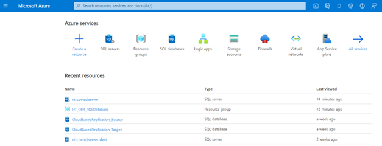

Apache Kafka as a Service by Confluent
<!--truncate-->

### Introduction
This article presents a proof of concept (PoC) of the group NewTechnologies@infologistix (NT) for cloud based replication (cbr) with Confluent cloud, the managed cloud service for Apache Kafka, and Microsoft Azure SQL databases, the database as a service on Microsoft Azure. The replication should be done by change data capture (CDC).
A combination of Confluent Cloud and managed Azure cloud services can be a really good choice for small enterprises as it provides the opportunity to develop serverless applications and therefore pay only for the data usage. That’s not the case when running Apache Kafka at your own data center or using other data streaming services on cloud platforms. And if your business will grow, you still stay flexible: At any point, it is possible to change subscription and get a dedicated cluster with private networking.  For situations that require dedicated clusters or a huge amount of data is shipped, Confluent Platform is probably the cheaper choices than Confluent Cloud.

*Figure 1: High level structure of the PoC*

The use case presented here, involves replicating data from a Azure SQL Database source to a Azure SQL Database target by applying the MS SQL server source and sink connector services of Confluent Cloud.  It’s a quit simple case, but a good way to get an impression how easy data replication and the usage of Confluent cloud can be. The whole configuration can be achieved just with the help of the Confluent and Microsoft Azure user interfaces. No coding is needed.
### Step by step to serverless data replication

<u> 1. Configuring Azure </u>

Microsoft Azure offers a variety of managed services built for the cloud. First, let’s see how we can create databases.  For our use case we are going to need a source and a sink database on separate database servers for each one of them.


*Figure 2: Azure Portal dashboard*

The first step is to log into the Azure portal. Then create a resource group. Here apart from the name of the group, the host region must be chosen. From the menu of the resource group, other services including the SQL database can be created and managed. 


*Figure 3: Create a resource group instance*

But first an SQL Database server is required. So go back to the home directory and click-on the SQL Database server service. In the create menu, it is asked to assign the server to a valid resource group. The full name of the new server will be the given name plus the suffix “.database.windows.net”. Please keep that in mind for later configurations.  It is preferred to choose the same host location as the one for the resource group. In the authentication section, a username or so-called “Server admin login” and a password must be given. Finally, it is advised to allow the azure services and resources to access your server.


*Figure 4: Create an SQL Server instance in the Resource group*

Now all the infrastructure to set up the SQL database is available. It can be done at either the SQL server menu or the resource group menu. At the create menu, there are various options regarding  the storage, pricing and performance of the database connection to fit every need. It is again important to allow access to the azure services and to add the client IP address to the firewall. The rest of the networking configurations are meant mostly for advanced users. 


*Figure 5: Create an SQL database instance in each SQL Server*

In this PoC the source SQL server is called  “nt-cbr-sqlserver” whereas the sink server “nt-cbr-sqlserver-dest”. The corresponding source database is called CloudBasedReplication_Source and the sink database “CloudBasedReplication_Target”. The server username is “Infologistix”. This info will be used to configure the confluent cloud connectors.


*Figure 6: Resource group Menu*

The database data can be accessed from the query editor inside the database menu or from an external client (e.g SQL Server Management Studio (SSMS)). Activity logs, properties and other information can also be found in the menu. To illustrate the data replication, a table “orderdetails” with the following structure is created in the “CloudBasedReplication_Source” database and is filled with some data:

```
CREATE TABLE orderdetails(
"ORDER_NUMBER" int identity (1,1) PRIMARY KEY,
"PRODUCT_CODE" int,
"QUANTITY_ORDERED" float,
"PRICE_EACH" decimal(10,5),
"CREATED_AT" datetime2 DEFAULT CURRENT_TIMESTAMP NOT NULL)
```
**Attention:** The timestamp column must always be of type datetime2. Other formats are not supported.

<u> 2. Configuring Confluent Cloud </u>

The initial step in the confluent cloud environment is to set up a cluster. One can choose between three providers: AWS, Google Cloud and Azure. Obviously, for this use case we are going to choose the Azure provider. Furthermore, the host region and the subscription type must be chosen. A basic subscription is enough in this case. For new accounts, a free trial of 2 months and consumption up to 400 US Dollars is offered. 


*Figure 7: Create Cluster page*


*Figure 8: Confluent Cloud Cluster dashboard*

Next, a schema at the environment dashboard needs to be defined. The Avro schema should be chosen.
Now, click-on the cluster menu. The first thing is to create an API Key to authenticate the cluster. The API key username and password should be saved during its generation. Afterwards there is no way to retrieve the password. 


*Figure 9: Schema Registry overview*


*Figure 10: Create API-Key page*

Now it is time to set up the SQL server source and sink connectors. There is a huge variety of connectors, so it is easier to use the search bar. Each field in the configuration interface has a sufficient explanation, but there are some details that need to be treated with more care.   


*Figure 11: Kafka Connector list*

<u>Source Connector</u>

First we will add and configure the source connector:

*Figure 12:  Add connector page*

The following screenshot shows the source connector’s configuration used in this example. Only the fields with a given value are visible here. The rest can be left empty, which means they will hold the default value:
```
       Source Connector Configuration:
{
  "connector.class": "MicrosoftSqlServerSource",
  "name": "MicrosoftSqlServerSourceConnector_0",
  "kafka.api.key": "****************",
  "kafka.api.secret": "****************************************************************",
  "topic.prefix": "src",
  "connection.host": "nt-cbr-sqlserver.database.windows.net",
  "connection.port": "1433",
  "connection.user": "Infologistix@nt-cbr-sqlserver",
  "db.name": "CloudBasedReplication_Source",
  "table.whitelist": [
    "orderdetails"
  ],
  "timestamp.column.name": [
    "CREATED_AT"
  ],
  "incrementing.column.name": "",
  "table.types": [
    "TABLE"
  ],
  "db.timezone": "Europe/Brussels",
  "numeric.mapping": "best_fit",
  "output.data.format": "AVRO",
  "tasks.max": "1"
}
```
The name and the login credentials of the source database and server, which were created in Azure, must be given here. The example names are used to show you how to fill in the blanks correctly. The source connector creates automatically a topic with the prefix “src” plus the initial table name “orderdetails”, which serializes the table data with the Avro schema and acts like a Kafka producer. One should be careful with the prefix and table names, as specific characters might cause connector failure. The bad thing is that the confluent error messages
might not identify the true cause of this problem. Underscores and dots are prohibited, whereas dash is allowed.

<u>Sink connector</u>

When adding the sink connector, proceed in the same way as for the source connector.
```
   Sink Connector Configuration:

{
  "topics": [
    "srcorderdetails"
  ],
  "input.data.format": "AVRO",
  "connector.class": "MicrosoftSqlServerSink",
  "name": "MicrosoftSqlServerSinkConnector_0",
  "kafka.api.key": "****************",
  "kafka.api.secret": "****************************************************************",
  "connection.host": "nt-cbr-sqlserver-dest.database.windows.net",
  "connection.port": "1433",
  "connection.user": "Infologistix@nt-cbr-sqlserver-dest",
  "db.name": "CloudBasedReplication_Target",
  "insert.mode": "INSERT",
  "db.timezone": "Europe/Brussels",
  "pk.mode": "none",
  "auto.create": "true",
  "auto.evolve": "true",
  "batch.sizes": "1000",
  "tasks.max": "1"
}
```
The name and the login credentials of the sink database need to be given here. Input format is AVRO. The sink connector consumes data from the topic “srcorderdetails” and load them into a table in the target database with the same name. Messages which cannot be loaded into the target are transferred it into a newly created Dead Letter Topic (in our case “dlq-lcc-50d8z”). Since the “auto.create” field is true, the table in the target Database is automatically created.
This should be the overview of the connector and topic sections by now. If the schema does not seem to be set for a topic, it can be manually set:


*Figure 13: Topics dashboard after all connections are set*

First we will add and configure the source connector:

*Figure 14: Connector’s dashboard  after all connections are set*

The data flow can be seen at section “Stream lineage” as below:


*Figure 15: Data flow*

Data are now present in the sink database:

First we will add and configure the source connector:

*Figure 16: View newly transferred data in query editor*

<u>Troubleshooting</u>

Sometimes the connectors fail to run at first. If the error is unexpected then deleting and recreating can help. It can also happen that the error disappears after a couple of minutes by itself.

<u>A few remarks about cdc connectors</u>

Now, every time new data arrives at the source database, they will be directly processed and stored at the sink database. It should be noted though, that this is true only for rows with a timestamp value greater than the one of the last fetch. If more than one timestamp columns is defined in the source connector configuration, then the first non-null value will be considered. Same applies to modified rows. They are simply dealt as new rows, rather than updated.

**Info:** The SQL server connectors are constantly upgraded to offer more options to the user. 

### Conclusion
Our proof of concept was able to show that it is extremely easy to use the functionality of Apache Kafka with the Confluent Cloud. A data replication for a table could be realized in a few minutes. However, the Confluent Cloud also offers the possibility to perform transformations through the integration of KSQL, so that ETL operations are also possible. In addition, this also enables problem-free changes of the SQL dialect, since date formats can be adapted through simple transformations. Scenarios in which an on premise database (e.g. IBM DB2 or Oracle DB) is replicated via confluent cloud and is then backed up in the Azure Cloud are therefore also no problem.
We hope we have been able to give you a small insight into the possibilities of managed cloud services from our partners Confluent and Microsoft and make it easier for you to get started with cloud computing.
